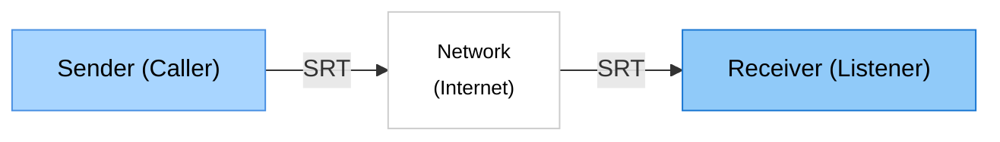

# SRT Probe

> 🌐 **Languages**: [English](README.md) | [日本語](README.ja.md) | [中文](README.zh.md) | [한국어](README.ko.md) | [Español](README.es.md)

> 🌐 Herramienta de prueba de red para el protocolo SRT

SRT Probe es una herramienta de prueba de red y medición de rendimiento para conexiones que utilizan el protocolo SRT (Secure Reliable Transport).

Visualiza estadísticas en tiempo real como RTT, rendimiento y pérdida de paquetes, ayudando a evaluar la calidad de la red.

Diseñado solo para pruebas de conexión, no maneja entrada/salida de video/audio.

## ✨ Características Principales

- 📊 **Estadísticas en Tiempo Real**: Muestra instantáneamente RTT, rendimiento y pérdida de paquetes
- 📈 **Gráficos de Rendimiento**: Visualización de gráficos dinámicos
- 🔄 **3 Modos de Conexión**: CALLER, LISTENER, RENDEZVOUS

## Usuarios Objetivo

- Desarrolladores de herramientas SRT, administradores de red

## 🚀 Configuración de Red

## Requisitos del Sistema
- Windows 10/11

## Capturas de Pantalla
- receiver

- sender

## 🚀 Cómo Usar

### 1. Iniciar la Aplicación

Haga doble clic en el icono **SRT Probe** en su escritorio o inícielo desde el menú Inicio.

### 2. Receiver (Lado Receptor)
- **Test Mode** `Receiver (listener)`: Espera la conexión del otro lado como servidor y recibe datos
- **Listen Port**: Número de puerto a utilizar (predeterminado: 9000)
- Haga clic en el botón **Start Test** para comenzar la prueba

### 3. Sender (Lado Emisor)
- **Test Mode** `Sender (caller)`: Se conecta al otro lado como cliente y envía datos
- **Destination IP**: Dirección IP a la que conectarse (ej: `192.168.1.100`)
- **Destination Port**: Número de puerto a utilizar (predeterminado: 9000)
- Haga clic en el botón **Start Test** para comenzar la prueba

## 📦 Instalación
### Fuera de Microsoft Store

1. Descargue la última versión desde la página de [Releases](https://github.com/VideoSupporter/srt-probe-dev/releases)

2. Ejecute el instalador

3. Después de completar la instalación, inicie desde el acceso directo del escritorio o el menú Inicio

## Guía Detallada

Para instrucciones de uso detalladas, consulte la [Página de Detalles](guides/README_DETAIL.es.md).

## 🔧 Solución de Problemas

Si encuentra algún problema, consulte la [Guía de Solución de Problemas](guides/TROUBLESHOOTING.es.md).

## 🤝 Soporte

### Informes de Errores y Solicitudes de Funciones
Si descubre un problema o tiene una sugerencia para una nueva función, háganoslo saber en [GitHub Issues](https://github.com/VideoSupporter/srt-probe-dev/issues).

