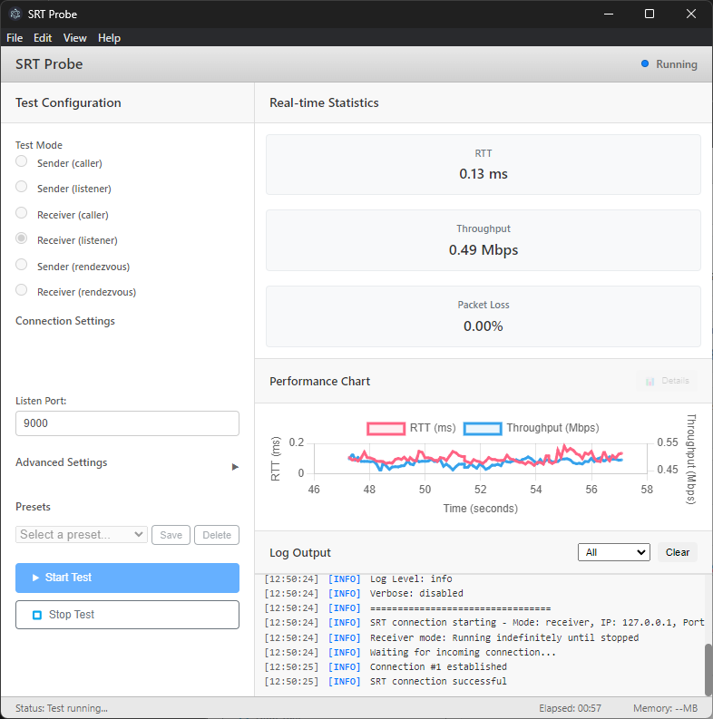

# SRT Probe

> 🌐 **Languages**: [English](README.md) | [日本語](README.ja.md) | [中文](README.zh.md) | [한국어](README.ko.md) | [Español](README.es.md)

> 🌐 SRT协议网络测试工具

SRT Probe 是一款使用 SRT（Secure Reliable Transport）协议进行网络连接测试和性能测量的工具。

实时可视化 RTT、吞吐量、丢包率等统计信息，支持网络质量评估。

仅用于连接测试，不处理视频/音频输入输出。

## ✨ 主要特点

- 📊 **实时统计**: 即时显示 RTT、吞吐量和丢包率
- 📈 **性能图表**: 动态图形可视化
- 🔄 **3种连接模式**: CALLER、LISTENER、RENDEZVOUS

## 目标用户

- SRT工具开发者、网络管理员

## 🚀 网络配置

## 系统要求
- Windows 10/11

## 截图
- receiver

- sender

## 🚀 使用方法

### 1. 启动应用程序

双击桌面上的 **SRT Probe** 图标，或从开始菜单启动。

### 2. Receiver (接收端)
- **Test Mode** `Receiver (listener)`: 作为服务器等待对方连接并接收数据
- **Listen Port**: 使用的端口号（默认: 9000）
- 点击 **Start Test** 按钮开始测试

### 3. Sender (发送端)
- **Test Mode** `Sender (caller)`: 作为客户端连接到对方并发送数据
- **Destination IP**: 要连接的IP地址（例如: `192.168.1.100`）
- **Destination Port**: 使用的端口号（默认: 9000）
- 点击 **Start Test** 按钮开始测试

## 📦 安装
### Microsoft Store 以外

1. 从 [Releases](https://github.com/VideoSupporter/srt-probe-dev/releases) 页面下载最新版本

2. 运行安装程序

3. 安装完成后，从桌面快捷方式或开始菜单启动

## 详细指南

有关详细使用说明，请参阅[详细页面](guides/README_DETAIL.zh.md)。

## 🔧 故障排除

如果遇到任何问题，请参阅[故障排除指南](guides/TROUBLESHOOTING.zh.md)。

## 🤝 支持

### 错误报告和功能请求
如果您发现问题或有新功能建议，请在 [GitHub Issues](https://github.com/VideoSupporter/srt-probe-dev/issues) 上告诉我们。

