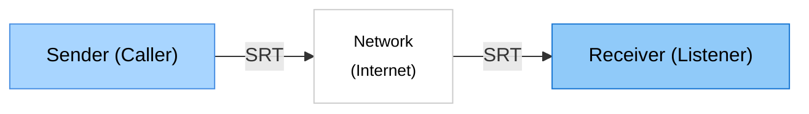

# SRT Probe

> 🌐 **Languages**: [English](index.md) | [日本語](README.ja.md) | [中文](README.zh.md) | [한국어](README.ko.md) | [Español](README.es.md)

> 🌐 SRTプロトコル用のネットワークテストツール

SRT Probe は、SRT（Secure Reliable Transport）プロトコルを使用したネットワーク接続のテストとパフォーマンス測定を行うツールです。

リアルタイムで RTT、スループット、パケットロスなどの統計情報を可視化し、ネットワーク品質の評価をサポートします。

接続テスト向けのみを想定しており、映像音声の入出力は行いません。

## ✨ 主な特徴

- 📊 **リアルタイム統計**: RTT、スループット、パケットロスを即座に表示
- 📈 **パフォーマンスチャート**: 動的なグラフ表示
- 🔄 **3つの接続モード**: CALLER、LISTENER、RENDEZVOUS

## 想定ユーザー

- SRT関連ツール関係者、ネットワーク管理者

## 🚀 ネットワーク構成

## システム要件
- Windows10/11

## スクリーンショット
- receiver

- sender

## 🚀 使い方

### 1. アプリケーションの起動

デスクトップの **SRT Probe** アイコンをダブルクリック、またはスタートメニューから起動します。

### 2. Receiver (受信側)
- **Test Mode** `Receiver (listener)` : サーバーとして相手からの接続を待機してデータを受信
- **Listen Port**: 使用するポート番号（デフォルト: 9000）
- **Start Test** ボタンをクリックしてテストを開始

### 3. Sender (送信側)
- **Test Mode** `Sender (caller)` : クライアントとして相手に接続してデータを送信
- **Destination IP** 接続先のIPアドレス（例: `192.168.1.100`）
- **Destination Port**: 使用するポート番号（デフォルト: 9000）
- **Start Test** ボタンをクリックしてテストを開始

## 📦 インストール
### Microsoft Store
[Microsoft Store](https://apps.microsoft.com/detail/9NLQLPL2SBZ1?hl=ja&gl=JP&ocid=pdpshare) ページから最新版をダウンロード、インストール:

### Microsoft Store以外

1. [Releases](https://github.com/videosupporter/srt-probe/releases) ページから最新版をダウンロード:

2. インストーラーを実行

3. インストール完了後、デスクトップのショートカットまたはスタートメニューから起動

## 詳細

詳細の使い方は、[詳細ページ](guides/README_DETAIL.ja.md) を参照してください。

## 🔧 トラブルシューティング

問題が発生した場合は、[トラブルシューティングガイド](guides/TROUBLESHOOTING.ja.md) を参照してください。

## 🤝 サポート

### バグ報告・機能リクエスト
問題を発見した場合や、新しい機能の提案がある場合は、[GitHub Issues](https://github.com/videosupporter/srt-probe/issues) でお知らせください。

