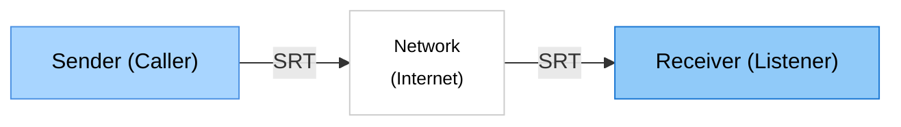
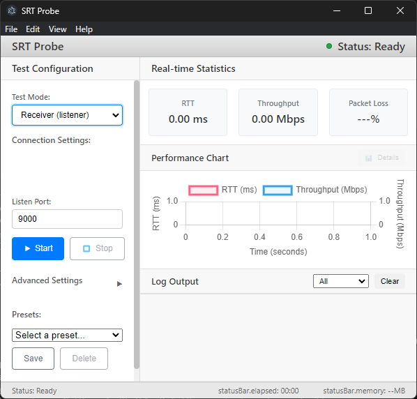
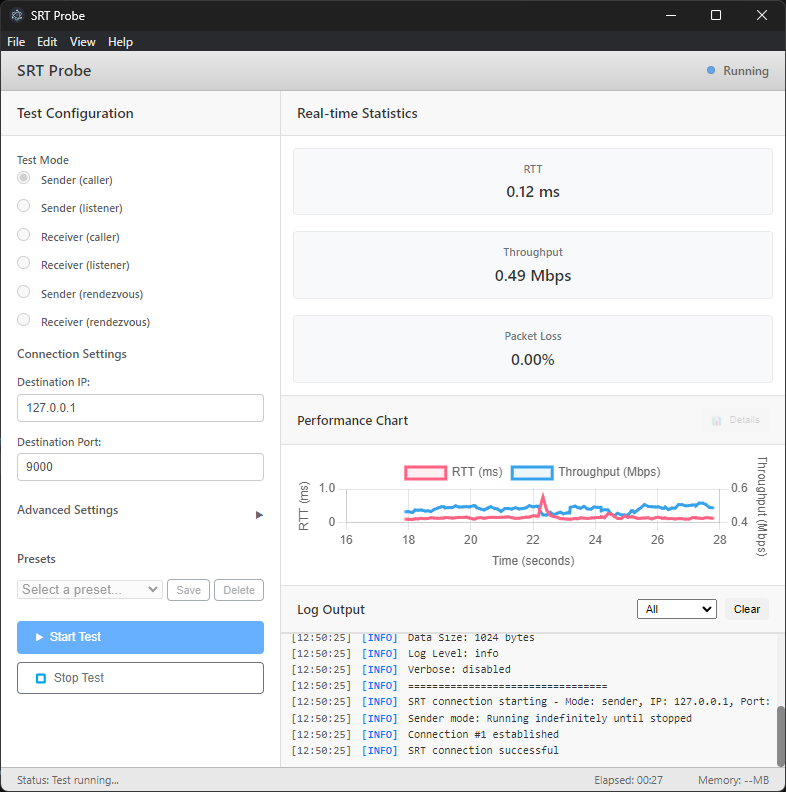

# SRT Probe

> 🌐 **Languages**: [English](index.md) | [日本語](README.ja.md) | [中文](README.zh.md) | [한국어](README.ko.md) | [Español](README.es.md)

> 🌐 SRT 프로토콜용 네트워크 테스트 도구

SRT Probe는 SRT(Secure Reliable Transport) 프로토콜을 사용한 네트워크 연결 테스트 및 성능 측정 도구입니다.

RTT, 처리량, 패킷 손실 등의 통계 정보를 실시간으로 시각화하여 네트워크 품질 평가를 지원합니다.

연결 테스트 전용으로 설계되었으며, 비디오/오디오 입출력은 처리하지 않습니다.

## ✨ 주요 기능

- 📊 **실시간 통계**: RTT, 처리량 및 패킷 손실을 즉시 표시
- 📈 **성능 차트**: 동적 그래프 시각화
- 🔄 **3가지 연결 모드**: CALLER, LISTENER, RENDEZVOUS

## 대상 사용자

- SRT 도구 개발자, 네트워크 관리자

## 🚀 네트워크 구성

## 시스템 요구사항
- Windows 10/11

## 스크린샷

### Receiver

### Sender

## 🚀 사용 방법

### 1. 애플리케이션 실행

바탕 화면의 **SRT Probe** 아이콘을 더블 클릭하거나 시작 메뉴에서 실행합니다.

### 2. Receiver (수신 측)
- **Test Mode** `Receiver (listener)`: 서버로서 상대방의 연결을 기다리고 데이터를 수신
- **Listen Port**: 사용할 포트 번호 (기본값: 9000)
- **Start Test** 버튼을 클릭하여 테스트 시작

### 3. Sender (송신 측)
- **Test Mode** `Sender (caller)`: 클라이언트로서 상대방에 연결하고 데이터를 송신
- **Destination IP**: 연결할 IP 주소 (예: `192.168.1.100`)
- **Destination Port**: 사용할 포트 번호 (기본값: 9000)
- **Start Test** 버튼을 클릭하여 테스트 시작

## 📦 설치
### Microsoft Store
[Microsoft Store](https://apps.microsoft.com/detail/9NLQLPL2SBZ1?hl=ko&gl=KR&ocid=pdpshare) 페이지에서 최신 버전을 다운로드하고 설치하십시오:

### Microsoft Store 이외

1. [Releases](https://github.com/videosupporter/srt-probe/releases) 페이지에서 최신 버전 다운로드

2. 설치 프로그램 실행

3. 설치 완료 후 바탕 화면 바로 가기 또는 시작 메뉴에서 실행

## 상세 가이드

자세한 사용 방법은 [상세 페이지](guides/README_DETAIL.ko.md)를 참조하세요.

## 🔧 문제 해결

문제가 발생한 경우 [문제 해결 가이드](guides/TROUBLESHOOTING.ko.md)를 참조하세요.

## 🤝 지원

### 버그 보고 및 기능 요청
문제를 발견하거나 새로운 기능에 대한 제안이 있는 경우 다음을 통해 알려주세요:

- [Google Forms](https://forms.gle/q97gbPZzTUqvL97V9)
- [GitHub Issues](https://github.com/videosupporter/srt-probe/issues)
