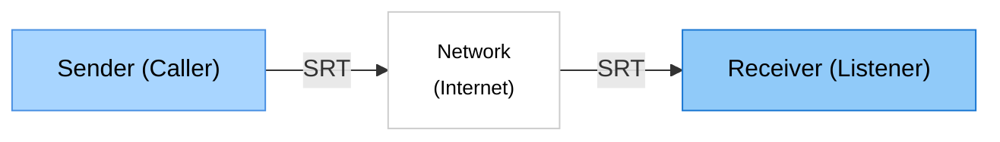

# SRT Probe

> 🌐 **Languages**: [English](index.md) | [日本語](README.ja.md) | [中文](README.zh.md) | [한국어](README.ko.md) | [Español](README.es.md)

> 🌐 Network testing tool for SRT protocol

SRT Probe is a network testing and performance measurement tool for connections using the SRT (Secure Reliable Transport) protocol.

It visualizes real-time statistics such as RTT, throughput, and packet loss, supporting network quality evaluation.

Designed for connection testing only, it does not handle video/audio input/output.

## ✨ Key Features

- 📊 **Real-time Statistics**: Instantly displays RTT, throughput, and packet loss
- 📈 **Performance Charts**: Dynamic graph visualization
- 🔄 **3 Connection Modes**: CALLER, LISTENER, RENDEZVOUS

## Target Users

- SRT tool developers, network administrators

## 🚀 Network Configuration

## System Requirements
- Windows 10/11

## Screenshots
- receiver

- sender

## 🚀 How to Use

### 1. Launching the Application

Double-click the **SRT Probe** icon on your desktop or launch it from the Start menu.

### 2. Receiver (Receiving Side)
- **Test Mode** `Receiver (listener)`: Waits for connection from the other side as a server and receives data
- **Listen Port**: Port number to use (default: 9000)
- Click the **Start Test** button to begin testing

### 3. Sender (Sending Side)
- **Test Mode** `Sender (caller)`: Connects to the other side as a client and sends data
- **Destination IP**: IP address to connect to (e.g., `192.168.1.100`)
- **Destination Port**: Port number to use (default: 9000)
- Click the **Start Test** button to begin testing

## 📦 Installation
### Microsoft Store
Download and install the latest version from the [Microsoft Store](https://apps.microsoft.com/detail/9NLQLPL2SBZ1?ocid=pdpshare) page:

### Outside Microsoft Store

1. Download the latest version from the [Releases](https://github.com/videosupporter/srt-probe/releases) page

2. Run the installer

3. After installation completes, launch from the desktop shortcut or Start menu

## Detailed Guide

For detailed usage instructions, please refer to the [Detail Page](guides/README_DETAIL.md).

## 🔧 Troubleshooting

If you encounter any issues, please refer to the [Troubleshooting Guide](guides/TROUBLESHOOTING.md).

## 🤝 Support

### Bug Reports & Feature Requests
If you discover a problem or have a suggestion for a new feature, please let us know on [GitHub Issues](https://github.com/videosupporter/srt-probe/issues).

